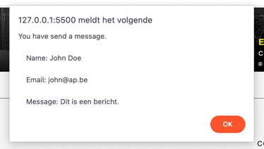

# Oefeningen labo 19

Zorg dat je de volgende folderstructuur volgt:

```
webtechnologie/
├─ labo-01/
│  ├─ oefening-01/
│  │  ├─ index.html
│  │  ├─ images/
│  │  │  ├─ image-1.jpg 
│  │  │  └─ image-n.jpg 
│  │  ├─ css/
│  │  │   ├─ reset.css
│  │  │   └─ style.css
│  │  └─ js/
│  │     └─ script.js
│  ├─ oefening-02/
│  └─ oefening-n/
├─ labo-02/
└─ labo-n/      
```

- Gebruik steeds JS modules om globale variabelen te vermijden (`<script type="module" src="./path/to/script.js" defer></script>`)
- Zet je Javascript file steeds in strict mode (`"use strict"`);
- Volg de [Coding Guidelines](https://apwt.gitbook.io/webtechnologie/coding-guidelines)
- De nodige bestanden staan reeds klaar in deze repository
- In je browser zou je het volgende moeten zien als je de pagina opent: 
- De folderstructuur blijft gelden: kopieer per oefening de gegeven bestanden naar een map `oefening-1`,...

## Oefening 1 - Formuliervalidatie

Je zal het formulier afhandelen in JavaScript.

### functionele analyse

* Zorg dat een error-bericht wordt getoont wanneer een veld niet ingevuld is.
* Zorg dat een success-bericht wordt getoont wanneer alle velden juist ingevuld zijn met daarin de waardes van het name, email en message veld.

### technische analyse

* Maak een bestand form.js.
* Koppel het bestand form.js aan de index.html.
* Geef het form-element een id en haal het op in je form.js met querySelector.
* Voeg een submit-eventlistener toe aan form.
* Haal de 3 velden op en kijk na of ze zijn ingevuld.
* niet ingevuld: geef een foutmelding
* ingevuld: geef een succesmelding
* Toon de ingevulde waarden aan de gebruiker via een `alert`.

### voorbeeldinteractie




## Oefening 2 - Frequently Asked Questions sectie (FAQ)

### functionele analyse

* Maak een inklapbare FAQ met behulp van JavaScript.
* Voeg HTML toe zoals visueel weergegeven in de voorbeeldinteractie.
* Elk inklapbaar element bestaat uit:
* een button met class `collapsible`
* een p-element met class `context`

### technische analyse

* Haal in faq.js alle elementen op met de klasse 'collapsible' en gebruik hierbij querySelectorAll.
* Loop over de array van elementen.
* Voeg voor elk element een 'click' eventlistener toe.
* Als er op een ingeklapt element wordt geklikt, wordt de inhoud zichtbaar.
* Als er op een opengeklapt element wordt geklikt, wordt de inhoud onzichtbaar.

### voorbeeldinteractie


## Oefening 3 - Social media icons

### functionele analyse

* Plaats de social media icons op het scherm vanuit JavaScript
* Voeg HTML toe zoals visueel weergegeven in de voorbeeldinteractie.
* Elk social media icon bestaat uit:
  * een li-element
  * een a-element met een juiste link
  * een img-element met een juist icoon

### technische analyse

* Maak een `socials.js`-bestand aan en plaats hierin de volgende arrays:
```javascript
const socialPlatforms = ["youtube", "instagram", "facebook", "twitter"];
const socialLinks = ["https://www.youtube.com", "https://www.instagram.com/", "https://www.facebook.com/", "https://twitter.com/"];
```

* Selecteer het `ul`-element met ID `socials` en voeg hier met behulp van JavaScript per social media platform de nodige elementen aan toe, bijvoorbeeld:
```html
<li>
 <a href="https://www.youtube.com" target="_blank">
    
 </a>
</li>
 ```

### voorbeeldinteractie


